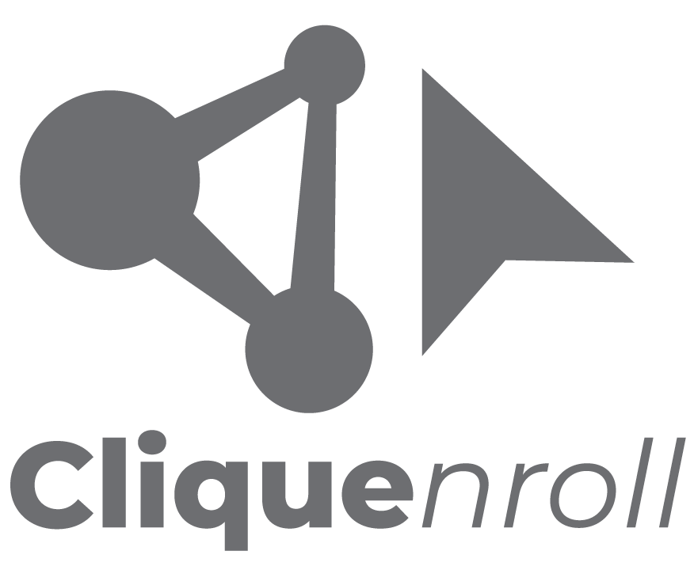

<!-- PROJECT SHIELDS -->
<!--
*** I'm using markdown "reference style" links for readability.
*** Reference links are enclosed in brackets [ ] instead of parentheses ( ).
*** See the bottom of this document for the declaration of the reference variables
*** for contributors-url, forks-url, etc. This is an optional, concise syntax you may use.
*** https://www.markdownguide.org/basic-syntax/#reference-style-links
-->

<!-- PROJECT LOGO -->
 

  

  

    Trabalho em progresso. Matrícula automatizada através da análise de redes.
     
  

<!-- ABOUT THE PROJECT -->
## About The Project

[![Chromosummary screenshot][product-screenshot]

Trabalho em progresso. Matrícula automatizada através da análise de redes.

### Built With
* [igraph](https://igraph.org/r/)

<!-- MARKDOWN LINKS & IMAGES -->
<!-- https://www.markdownguide.org/basic-syntax/#reference-style-links -->
[product-screenshot]: clique.png